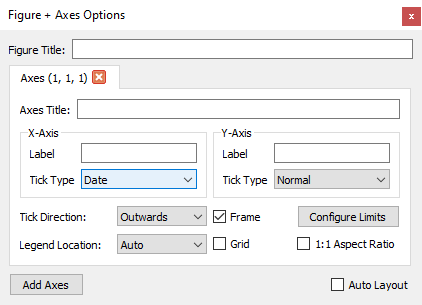

Parsing
=======

``plopy`` loops over the lines in a file, splitting lines into columns by
spaces or commas. If every column can be converted to a value, the values are
added to an array. Then, if the array has at least one row and the number of
columns does not change from row to row, the file is plotted.

This process will work on files where columns are delimited by spaces, commas,
or a combination of both, and will automatically skip headers or corrupted lines.

Dates
-----
``plopy`` will attempt to parse dates automatically with ``dateutil.parser``
if parsing as float is not successful. This will successfully parse
ISO-formatted dates with any delimiter between them, except spaces or commas
(since that will result in parts of the date being treated as separate columns).
Dates are then converted into ``matplotlib``'s representation of dates as the
number of days since the year 0. To display this as a proper date, set the tick
locations and formatting to Date in ``Format > Configure Axes``.
Note that plotting will not work if negative numbers are included in the column
that is set to be displayed as dates.

If your dates don't comply with `ISO 8601 <https://xkcd.com/1179/>`_, you can
choose a different format in ``File > Configure Parsing``.

.. image:: images/choose_date_format.png
