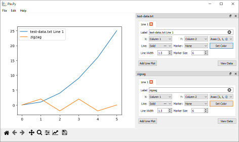

Scripting
=========

>>> from plopy import add_file, add_array, start
>>> add_array([(0, 0), (1, 2), (2, -2), (3, 2), (4, -2), (5, 0)], "zigzag")
True
>>> add_file("test-data.txt")
True
>>> add_file("nonexistent.csv")
[PloPy]: 'nonexistent.csv' is not a file.
False
>>> start()

.. automodule:: plopy
   :members: add_array, add_file, suppress_errors, fig, ax, start, array_from_file
